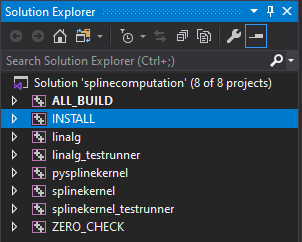
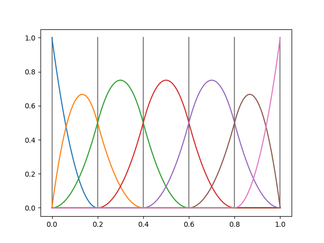
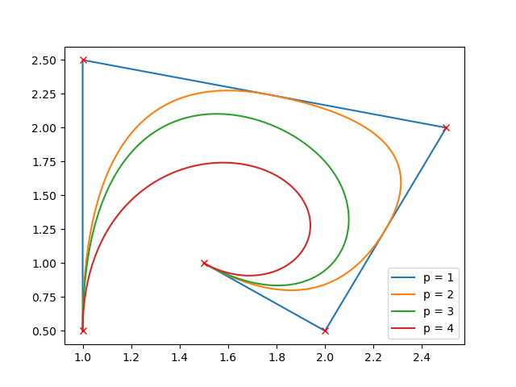
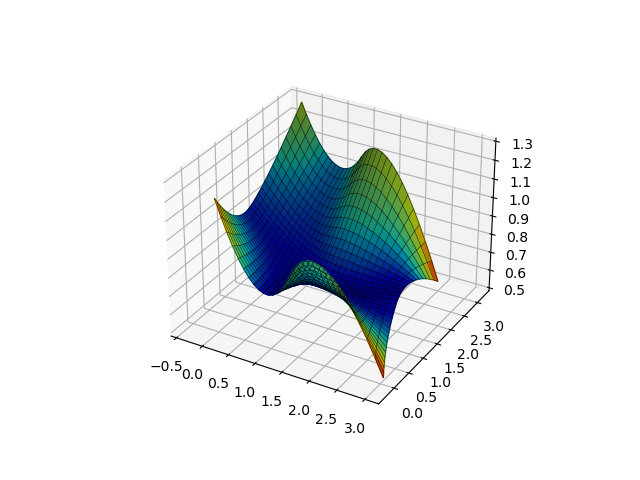
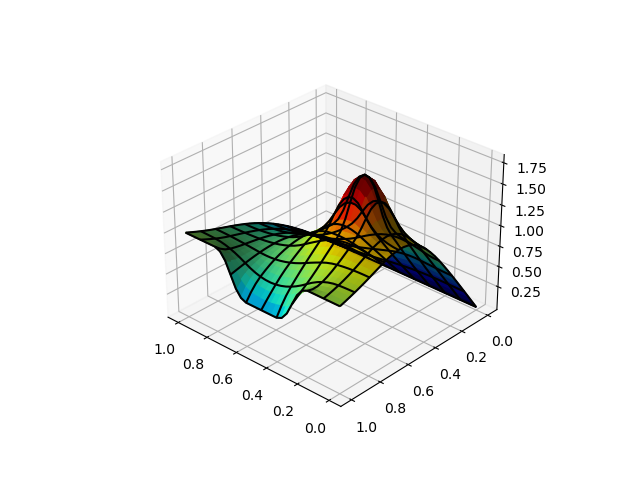

B-Spline-FEM-Computation
=======================

> FE code that discretizes a two-dimensional Poisson’s equation using B-Spline basis functions.

---

## Setup
1. Recursively clone this project to your machine: `git clone --recursive git@github.com:hmhuang0501/B-Spline-FEM-Computation.git`
2. Use Cmake to build/generate project files corresponding to your preferred complier/IDE, e.g., Visual Studio 2019  
   (Remember to tick the "PYBIND11_INSTALL" box, otherwise there will be "ImportError: DLL not found" message)  
   
3. Open project solution file (in this case **splinecomputation.sln**)
4. Go to Solution Explorer, right-click on "INSTALL", choose "build"  
   
5. A new folder called "install" will be generated under your build folder
6. After this step you can go to the "install" folder and run the _splinekernel testrunner_ or _any python scripts_  
   

---

## How To Use

In the **install** folder, you can play around with:

- splinekernel testrunner
  - CMD  
    
  - Git Bash  
    
- python scripts
  ```python
  python plotBSplineBasis.py
  ``` 
    
  
  ```python
  python plotBSplineCurve.py
  ```
    
  
  ```python
  python plotBSplineBasis2D.py
  ```
    
  
  ```python
  python plotBSplineSurface.py
  ```
    
  
  ```python
  python laplaceProblem.py
  ```
    

---
